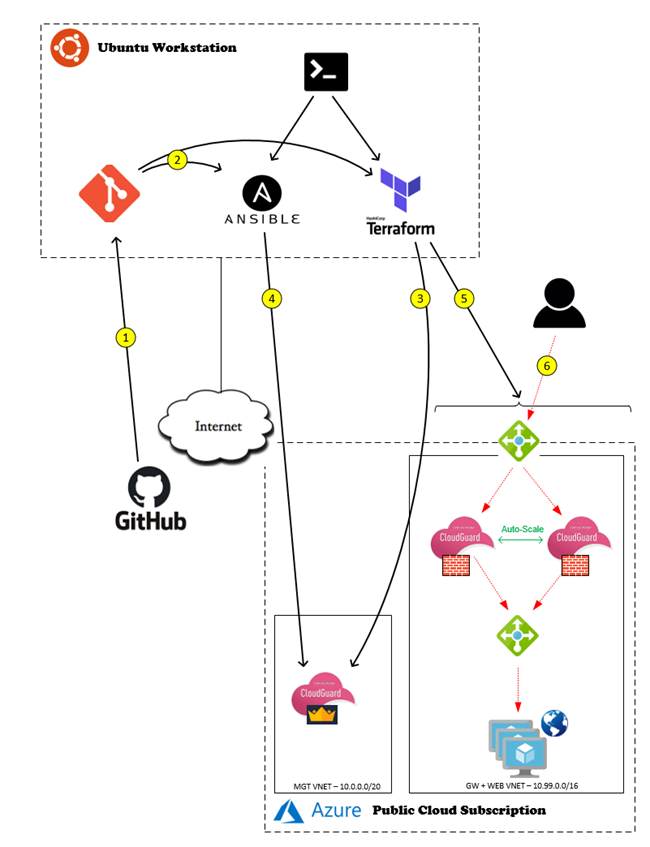

# Automation & Orchestration with Check Point IaaS / Azure
This project demonstrate some automation capabilities of Check Point & Azure using various 3rd party tools.

## Overview of Environment
Here is an overview of the environment we will be building:

 </a>

Here is a summary of the step-by-step process labelled on the picture:

1.	The main pool of code used is in this github repository - the 1st step is to copy this onto the Ubuntu workstation ideally via a ‘git pull’ to the local repository

2.	Once completed, there will be 2 different Terraform directories and 1 Ansible directory plus the secureme.sh script at the top level
 
3.	When the secureme.sh script is run, this will activate the sequence of events to build / configure the environment.  The first main action will be to run a ‘terraform apply’ in the TfSms directory which will build the Check Point Mgmt server in Azure

4.	Once the Mgmt server is built, an ansible playbook will be run to configure the objects / access policy / NAT policy on the Mgmt server plus activate a tool called CME (Cloud Management Extension) which will orchestrate the configuration of any gateways deployed in the Azure subscription

5.	Once complete, the final action will be to deploy the remainder of the infrastructure in Azure consisting of auto-scaling Check Point Gateways, auto-scaling web servers and some load balancers to support this infrastructure 

6.	Once the script is complete, you will be able to test live web traffic to the new web environment

## Further Info
For a more detailed analysis of the code, processes and pre-requisites to build this environment, take a look at my article on "Check Mates", our Check Point community hub here:

https://community.checkpoint.com/t5/API-CLI-Discussion-and-Samples/Automation-amp-Orchestration-with-Check-Point-IaaS-Azure/m-p/95914#M5147

Note - I have updated this project to use Check Point R81 and added a bunch of enhancements - check it out here:

https://github.com/philipatkinson86/checkpoint-r81-azure-automation
